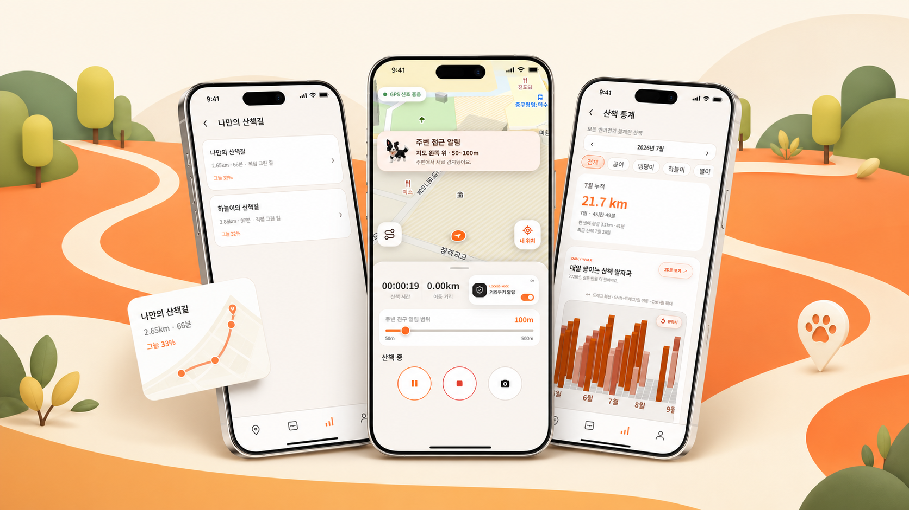
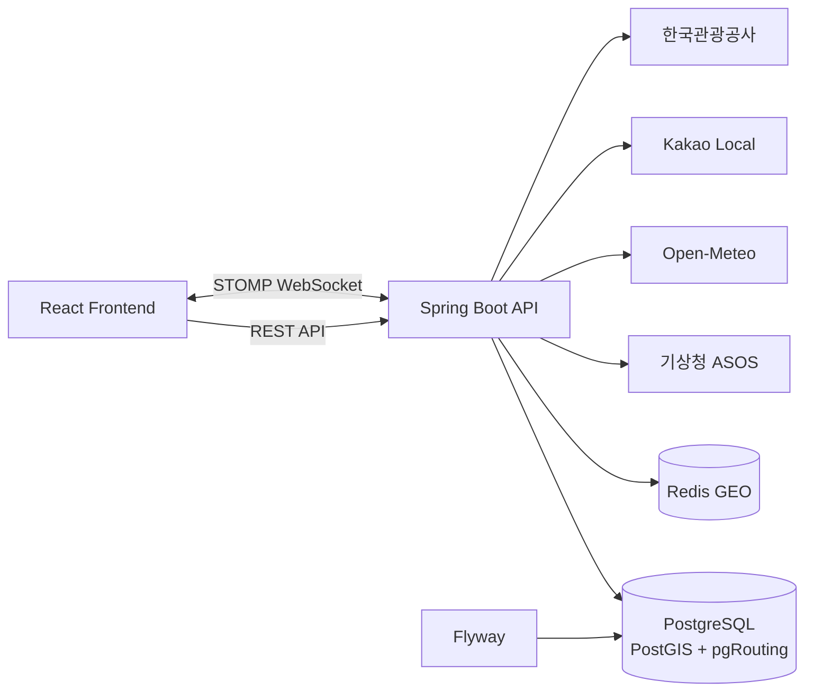

<div align="center">
  

  <h3>시간과 환경을 고려하는 반려견 산책 플랫폼 API</h3>

  <p>
    목표 시간 기반 코스 추천, 그늘·추정 노면온도 분석,<br />
    실시간 산책 기록과 반려견 조우 제어를 제공하는 멍루트 백엔드입니다.
  </p>

  <p>
    
    
    
    
    
  </p>
</div>



## 백엔드 소개

멍루트 백엔드는 사용자의 대표 코스와 목표 산책 시간을 바탕으로 보행 경로를 만들고, 시간대별 그늘과 추정 노면온도를 계산해 코스 선택 근거를 제공합니다.

산책 중에는 GPS 기록, 맵매칭, 실시간 위치와 주변 반려견 접근 상태를 처리하며, 산책 후에는 기록·통계·대표 코스·그룹 공유 데이터로 연결합니다.

## 주요 기능

| 도메인 | 기능 |
| --- | --- |
| 인증·사용자 | 회원가입, 로그인, JWT 재발급, 비밀번호 재설정, 사용자·반려견 프로필 관리 |
| 코스 추천 | 목표 시간 기반 후보 생성, 대표 코스 비교, 변경 구간과 추천 근거 제공 |
| 코스 진단 | 시간대별 그늘, 추정 노면온도, 구간별 환경 지표 계산 |
| 코스 그리기 | 사용자가 지정한 지점을 보행망에 연결하고 직접 그린 코스로 저장 |
| 산책 기록 | 산책 시작·일시정지·종료, GPS 포인트 저장, 맵매칭, 기록·통계 조회 |
| 조우 제어 | 거리두기·만나기 모드, 주변 사용자 탐색, 접근 추세와 알림 처리 |
| 그룹 | 그룹 생성·가입, 코스 공유·저장, 활동 피드와 WebSocket 이벤트 |
| 장소 | 반려동물 동반 장소 검색과 외부 장소 데이터 연동 |

## 시스템 구성



## 기술 스택

| 구분 | 기술 |
| --- | --- |
| Language | Java 21 |
| Framework | Spring Boot 4.1, Spring MVC, Spring Security, Spring Validation |
| Persistence | Spring Data JPA, Spring JDBC, Hibernate Spatial, Flyway |
| Database | PostgreSQL, PostGIS, pgRouting |
| Realtime | Spring WebSocket, STOMP, Redis GEO |
| Auth | JWT Access Token, Refresh Token, OAuth2 Resource Server |
| Observability | Spring Boot Actuator, Micrometer, Prometheus |
| API Docs | springdoc-openapi, Swagger UI |
| Test | JUnit 5, Spring Boot Test, PostgreSQL·Redis 통합 테스트 |
| Deploy | Docker, Render, Supabase, GitHub Actions |

## 디렉터리 구조

```text
backend/
├─ src/
│  ├─ main/
│  │  ├─ java/com/mungroute/
│  │  │  ├─ auth/          # 인증·토큰·Spring Security
│  │  │  ├─ course/        # 코스 추천·진단·직접 그리기
│  │  │  ├─ walk/          # 산책 세션·GPS·기록·통계
│  │  │  ├─ proximity/     # 거리두기·실시간 주변 탐색
│  │  │  ├─ meet/          # 만나기 요청·수락·차단
│  │  │  ├─ group/         # 그룹·공유 코스·활동
│  │  │  ├─ place/         # 반려동물 동반 장소
│  │  │  ├─ thermal/       # 그늘·노면온도 데이터 조회
│  │  │  ├─ weather/       # 기상 데이터 연동
│  │  │  ├─ user/          # 사용자·반려견·알림 설정
│  │  │  └─ global/        # 공통 응답·예외·설정
│  │  └─ resources/
│  │     ├─ db/migration/  # Flyway 스키마 마이그레이션
│  │     ├─ application.yml
│  │     ├─ application-local.yml
│  │     └─ application-prod.yml
│  └─ test/                # 단위·통합 테스트
├─ docs/                   # API 계약·배포·운영 문서
├─ infra/                  # Prometheus 등 로컬 관측 구성
├─ performance/            # WebSocket·근접 기능 부하 테스트
├─ docker-compose.yaml     # PostGIS·pgRouting·Redis
├─ Dockerfile
├─ .env.example
└─ build.gradle
```

## 사전 요구사항

- Java 21
- Docker Desktop 또는 Docker Engine + Compose
- Git

Gradle은 Wrapper가 포함되어 있어 별도 설치하지 않아도 됩니다. 로컬 PostgreSQL과 Redis도 Docker Compose로 실행할 수 있습니다.

## 로컬 실행

### 1. 저장소와 환경 변수 준비

```bash
git clone https://github.com/mungroute/backend.git
cd backend
cp .env.example .env
```

Windows PowerShell에서는 다음 명령을 사용할 수 있습니다.

```powershell
Copy-Item .env.example .env
```

### 2. PostGIS·Redis 실행

```bash
docker compose up -d
docker compose ps
```

기본 로컬 포트는 다음과 같습니다.

- PostgreSQL: `15432`
- Redis: `16379`

### 3. 애플리케이션 실행

```bash
# macOS / Linux
./gradlew bootRun

# Windows
gradlew.bat bootRun
```

서버는 기본적으로 `http://localhost:8080`에서 실행됩니다.

- Health Check: `http://localhost:8080/api/health`
- Swagger UI: `http://localhost:8080/swagger-ui.html`
- Actuator Health: `http://localhost:8080/actuator/health`

## 환경 변수

### 로컬 인프라

| 변수 | 기본 예시 | 설명 |
| --- | --- | --- |
| `POSTGIS_IMAGE` | `pgrouting/pgrouting:16-3.5-3.8` | PostGIS·pgRouting 이미지 |
| `DB_CONTAINER_NAME` | `mungroute-db` | DB 컨테이너 이름 |
| `POSTGRES_DB` | `mungroute` | 데이터베이스 이름 |
| `POSTGRES_USER` | `mungroute` | 데이터베이스 사용자 |
| `POSTGRES_PASSWORD` | `mungroute` | 로컬 개발 비밀번호 |
| `POSTGRES_PORT` | `15432` | 호스트 DB 포트 |
| `REDIS_IMAGE` | `redis:7.4-alpine` | Redis 이미지 |
| `REDIS_CONTAINER_NAME` | `mungroute-redis` | Redis 컨테이너 이름 |
| `REDIS_PORT` | `16379` | 호스트 Redis 포트 |
| `TZ` | `Asia/Seoul` | 컨테이너 시간대 |

### 애플리케이션·외부 API

| 변수 | 필수 환경 | 설명 |
| --- | :---: | --- |
| `SPRING_PROFILES_ACTIVE` | 운영 | 실행 프로필. 운영은 `prod` |
| `JWT_SECRET` | 운영 | 32바이트 이상의 JWT 서명 비밀값 |
| `JWT_COOKIE_SECURE` | 운영 | HTTPS 환경에서는 `true` |
| `JWT_COOKIE_SAME_SITE` | 운영 | 교차 Origin 운영 구성에서는 일반적으로 `None` |
| `CORS_ALLOWED_ORIGIN_PATTERNS` | 운영 | 허용할 프론트엔드 Origin |
| `DB_URL`, `DB_USERNAME`, `DB_PASSWORD` | 운영 | 운영 PostgreSQL 연결 정보 |
| `REDIS_URL` | 운영 | 운영 Redis 연결 주소 |
| `KMA_API_HUB_AUTH_KEY` | 선택 | 기상청 API허브 인증키 |
| `KAKAO_REST_API_KEY` | 선택 | Kakao Local REST API 키 |
| `KTO_PET_TOUR_SERVICE_KEY` | 선택 | 한국관광공사 반려동물 동반여행 API 키 |
| `KMA_ASOS_STATION_ID` | 선택 | ASOS 관측소 ID. 기본값은 서울 `108` |
| `PORT` | 운영 | 서버 포트. Render가 자동 주입 |

> 비밀번호와 API 키가 들어 있는 `.env`는 커밋하지 마세요. 저장소에는 변수명과 로컬 예시만 담은 `.env.example`만 포함합니다.

## 데이터베이스

- Flyway가 애플리케이션 시작 시 `src/main/resources/db/migration`을 검증하고 적용합니다.
- PostGIS는 GPS 포인트, 코스 LineString과 공간 검색에 사용합니다.
- pgRouting은 보행망 연결과 코스 후보 생성에 사용합니다.
- 운영 환경에서는 Supabase Database Extensions에서 `postgis`, `pgrouting`을 활성화해야 합니다.

마이그레이션 파일을 수정하지 말고, 스키마 변경 시 새로운 버전의 SQL 파일을 추가합니다.

```text
src/main/resources/db/migration/
└─ V{version}__{description}.sql
```

## 테스트

```bash
# 전체 단위 테스트
./gradlew test

# Windows
gradlew.bat test
```

실제 PostgreSQL·Redis가 필요한 통합 테스트는 인프라 실행 후 환경 변수를 활성화합니다.

```bash
RUN_DB_INTEGRATION_TESTS=true ./gradlew test
```

Windows PowerShell:

```powershell
$env:RUN_DB_INTEGRATION_TESTS='true'
.\gradlew.bat test
```

## 빌드

```bash
./gradlew clean bootJar
docker build -t mungroute-backend .
```

생성된 실행 JAR은 `build/libs/`에서 확인할 수 있습니다.

## 배포

- `develop`, `main` 대상 PR과 Push에서 Gradle 테스트, JAR, Docker 빌드를 검증합니다.
- `develop` 브랜치 검증 성공 후 Render Deploy Hook으로 배포합니다.
- 운영 DB는 Supabase PostgreSQL을 사용하며 Flyway가 스키마를 적용합니다.
- 실시간 위치 상태는 운영 Redis에 저장합니다.

자세한 내용은 [Render + Supabase 배포 가이드](docs/deployment-render-supabase.md)를 참고하세요.

## 관련 저장소

- Frontend: [mungroute/frontend](https://github.com/mungroute/frontend)

